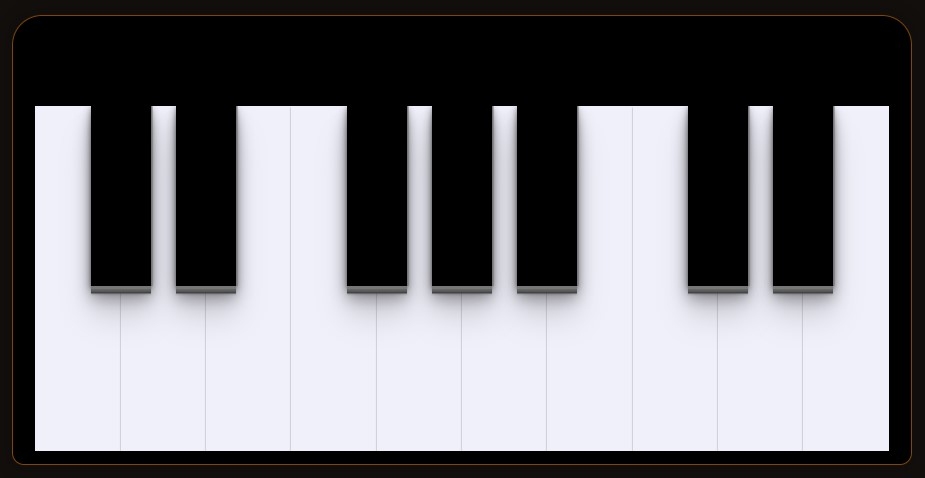

# Piano
### Projeto de manipulação com DOM

    

Este é um projeto <em>em desenvolvimento</em> que explora a manipulação do DOM (Document Object Model) para criar uma simulação interativa de um piano. O objetivo é proporcionar uma experiência musical envolvente, permitindo que os usuários toquem diferentes notas ao interagir com as teclas do piano na interface.

Funcionalidades
Interatividade: Cada tecla do piano pode ser clicada para tocar a nota correspondente.

Feedback visual: As teclas pressionadas mudam de cor, proporcionando um feedback visual instantâneo.

Compatibilidade com teclado: O projeto permite que os usuários toquem as notas usando as teclas do teclado do computador.

## Tecnologias Utilizadas
- HTML
- CSS
- JavaScript

## Como Executar o Projeto
Clone este repositório para sua máquina local.  Abra o arquivo index.html em seu navegador.   
Interaja com o piano e divirta-se! 

## Contribuições
Contribuições são bem-vindas! Sinta-se à vontade para abrir issues ou pull requests.