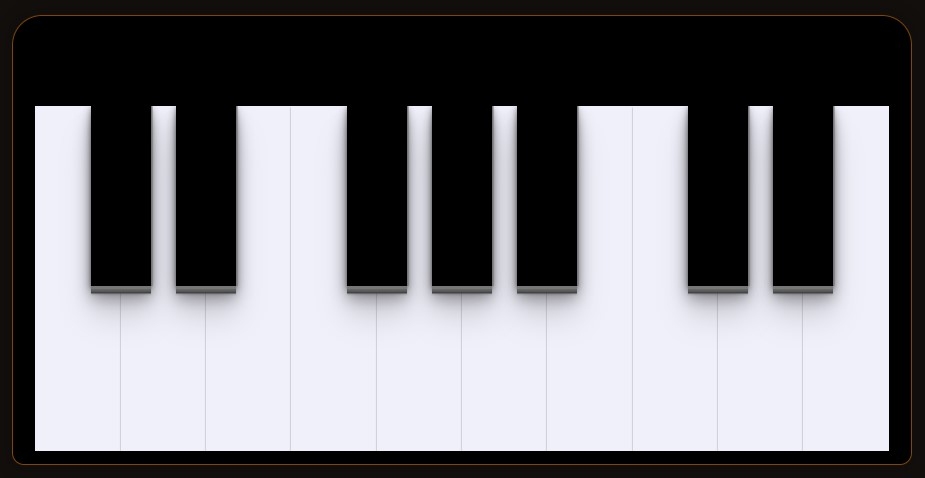

# Piano

    

This is a <em>work in progress</em> project that explores DOM (Document Object Model) manipulation to create an interactive piano simulation. The goal is to provide an engaging musical experience, allowing users to play different notes by interacting with the piano keys on the interface.
 
 
## Features:
- <strong>Interactivity:</strong> Each piano key can be clicked to play the corresponding note.
- <strong>Visual feedback:</strong> Pressed keys change color, providing instant visual feedback.
- <strong>Keyboard compatibility:</strong> The project allows users to play notes using their computer keyboard keys.

## Technologies Used
- HTML;
- CSS;
- JavaScript;

## How to Run the Project
Clone this repository to your local machine.  Open the index.html file in your browser.   
Interact with the piano and have fun! 

## Contributions
Contributions are welcome! Feel free to open issues or pull requests.
